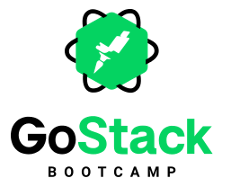

<h1 align="center">
    
</h1>

<h2 align="center">
  Bem vindo(a) ao repositório de registros das atividades realizadas durante o Bootcamp GoStack 10
</h2>

  <a href="#o-que-é">O que é</a>&nbsp;&nbsp;&nbsp;|&nbsp;&nbsp;&nbsp;
  <a href="#organização-do-material">Organização do material</a>&nbsp;&nbsp;&nbsp;|&nbsp;&nbsp;&nbsp;
  <a href="#requisitos-de-sistema">Requisitos de sistema</a>&nbsp;&nbsp;&nbsp;|&nbsp;&nbsp;&nbsp;
  <a href="#iniciando-um-projeto">Iniciando um projeto</a>&nbsp;&nbsp;&nbsp;|&nbsp;&nbsp;&nbsp;
  <a href="#índice-dos-projetos">Índice dos projetos</a>&nbsp;&nbsp;&nbsp;|&nbsp;&nbsp;&nbsp;
  <a href="#licença">Licença</a>

---
 

### O que é
Este repositório destinasse à armazenar as atividades desenvolvidas durante as aulas da décima edição do Bootcamp GoStack, as atividades incluídas aqui correspondem aos projetos de exemplos desenvolvidos acompanhando as video aulas, assim como aos desafios propostos após o final de cada aprendizado.

 

### Organização do material
Os projetos armazenados neste repositório estão estruturados em um modelo de monorepo construído com yarn, caso você tenha alguma dúvida de como funciona um monorepo com yarn consulte [Workspaces in Yarn](https://classic.yarnpkg.com/blog/2017/08/02/introducing-workspaces/).
Os projetos desenvolvidos estão disponíveis dentro do diretório [packages](./packages) e recebem o nome que foi proposto na aula ou desafio. Alguns projetos foram iniciados em uma aula e tiveram desafios para que fossem incrementados, do mesmo modo um projeto pode ser o resultado de vários desafios, nos arquivos README de cada projeto você encontrará uma descrição que lhe informará a origem do mesmo, também haverá instruções para à sua execução, os projetos frutos de desafios possuem um diretório chamado *_instruction*, este diretório possui uma cópia das instruções que foram fornecidas para a elaboração dos mesmos.

#### Exceção a regra
Existem três projetos desenvolvidos na décima edição do Bootcamp GoStack que não estão inclusos dentro deste repositório, por se tratarem de projetos muito extensos, esse ganharam lugares de destaque em seus próprios repositórios, mas não se preocupe, na sessão de [índice dos projetos](#Índice-dos-projetos) você encontrará um link que lhe levará até esses repositórios.
Dentro do diretório packages ha um projeto chamado eslint-config, esse não corresponde a um projeto desenvolvido durante o curso, o mesmo foi criado para facilitar a criação de regras do eslint de modo que fossem compartilhadas entre os demais projetos, essa é uma estratégia comum em monorepos.

 

### Requisitos de sistema
Para executar qualquer um dos projetos contidos neste repositório, você vai precisar dos seguintes recursos instalados em seu ambiente de trabalho.
* Node ^12.16.1
* Yarn ^1.22.5

Alguns projetos podem exigir a instalação de outros recursos exclusivos para os mesmos, nesses casos haverá uma descrição no arquivo README do projeto informando sobre quais são estes recursos necessários.

 

### Iniciando um projeto
Conforme já mencionado, cada projeto possui seu próprio arquivo README com instruções para sua execução, mas estes partem do principio de que você tenha realizado estes pré requisitos:
* Faça um clone deste repositório para seu ambiente de trabalho.
* Por meio do terminal execute o comando `yarn` para baixar as dependências de todos os projetos.

 

### Índice dos projetos
Abaixo estão listados os nomes de todos os projetos, uma breve descrição sobre os mesmos e um link para acessar seu local de origem.

**Projetos localizados neste repositório**
* [face-fake:](./packages/face-fake) Uma pseudo tela do facebook com uma listagem de posts e comentários fixos.
* [first-api:](./packages/first-api) Primeira aplicação node desenvolvida, manipula uma lista de usuários em uma array.
* [first-react-app:](./packages/first-react-app) Primeira aplicação React Native desenvolvida, lista usuários do github.
* [first-react-js:](./packages/first-react-js) Primeira aplicação ReactJs desenvolvida, manipula uma lista usando o conceito de estado.
* [jest:](./packages/jest) Demonstração de testes automatizados no backend, web e mobile.
* [list-repository:](./packages/list-repository) Projeto web que apresenta uma lista de repositórios do github e seus detalhes
* [project-task:](./packages/project-task) API simples para manipular projetos e tarefas
* [react-hooks:](./packages/react-hooks) Projeto node para demonstração do uso de hooks

**Projetos localizados em outros repositórios**
* fast-feet: Aplicação completa backend, web e mobile para gerenciar entregas
* go-barber: Aplicação completa backend, web e mobile para gerenciar uma barbearia
* [rocket-shoes:](https://github.com/mauricio-andre/Rocketshoes) Um e-commerce web e mobile que demonstra o uso da arquitetura flux

### Licença
Esse projeto está sob licença MIT, veja o arquivo de [LICENSE](./LICENSE) para mais detalhes
