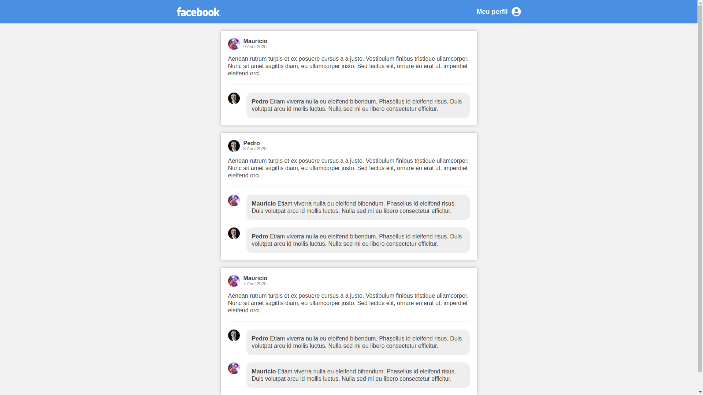

<h1 align="center">
  FACE-FAKE
</h1>

  <a href="#lista-de-correspondências">Lista de correspondências</a>&nbsp;&nbsp;&nbsp;|&nbsp;&nbsp;&nbsp;
  <a href="#sobre-o-projeto">Sobre o projeto</a>&nbsp;&nbsp;&nbsp;|&nbsp;&nbsp;&nbsp;
  <a href="#execução">Execução</a>

---
 

## Lista de correspondências
* [Desafio 4: Introdução ao React](./_instruction/Desafio04.md)

## Sobre o projeto
Este é um projeto ReactJs que apresenta uma pseudo página do facebook. Batizado de face-fake, o mesmo apresenta um cabeçalho com um menu falso de perfil e uma listagem de posts e comentários fixos renderizados pelo ReactJS. O resultado final do projeto é o seguinte.

  

## Execução
Para executar este projeto acesse o diretório do mesmo por meio do terminal e execute o comando `yarn dev`

Você também pode gerar o pacote de build deste projeto executando o comando `yarn build`
