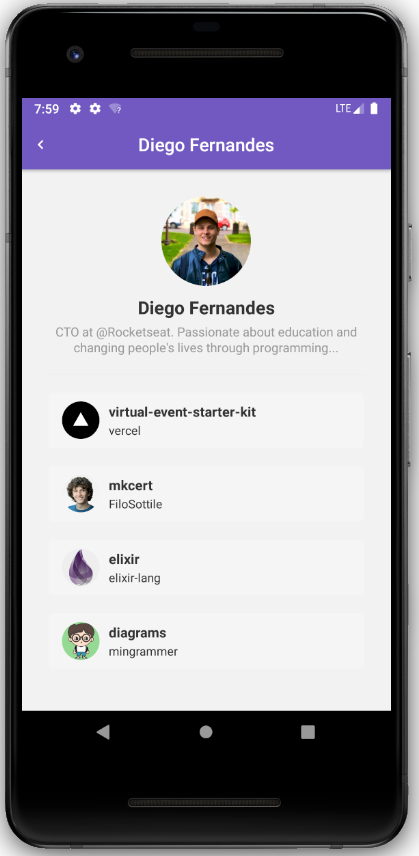

<h1 align="center">
  FACE-FAKE
</h1>

  <a href="#lista-de-correspondências">Lista de correspondências</a>&nbsp;&nbsp;&nbsp;|&nbsp;&nbsp;&nbsp;
  <a href="#sobre-o-projeto">Sobre o projeto</a>&nbsp;&nbsp;&nbsp;|&nbsp;&nbsp;&nbsp;
  <a href="#execução">Execução</a>

---
 

## Lista de correspondências
* Módule 6: Introdução ao React
* [Desafio 6: Introdução ao React](./_instruction/Desafio06.md)

## Sobre o projeto
Este é um projeto React Native que apresenta uma interface na qual é possível incluir usuários do github a uma listagem armazenada no equivalente localStorage do celular, após incluir um usuário, é possível consultar a listagem de projetos favoritos do mesmo, assim como consultar os detalhes de cada projeto acessando o mesmo dentro do próprio aplicativo por meio de uma webView.

  

## Execução
Para executar este projeto você vai precisar instalar um emulador de celular em seu computador, ou conectar seu dispositivo físico ao computador estando este devidamente configurado para permitir instalações de programas fora da loja oficial de seu provedor. Este projeto não foi testado em um dispositivo IPhone.

Acesse o diretório do projeto pelo terminal e execute o comando `yarn android` se o seu dispositivo físico ou emulado for um android, ou `yarn ios` se o mesmo for um IPhone, este comando vai instalar o app em seu celular, após a instalação se o bundle não for executado automaticamente, execute o comando `yarn start`, pode ser necessário fechar e abrir novamente o seu app em seu celular.
