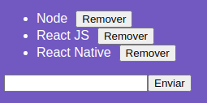

<h1 align="center">
  FIRST-REACT-JS
</h1>

  <a href="#lista-de-correspondências">Lista de correspondências</a>&nbsp;&nbsp;&nbsp;|&nbsp;&nbsp;&nbsp;
  <a href="#sobre-o-projeto">Sobre o projeto</a>&nbsp;&nbsp;&nbsp;|&nbsp;&nbsp;&nbsp;
  <a href="#execução">Execução</a>

---
 

## Lista de correspondências
* Modulo 4: Introdução ao React

## Sobre o projeto
Este é o primeiro projeto ReactJs construído, o mesmo é uma simples aplicação web que controla uma listagem armazenada no locaStorage.

  

## Execução
Para executar este projeto acesse o diretório do mesmo por meio do terminal e execute o comando `yarn dev`

Você também pode gerar o pacote de build deste projeto executando o comando `yarn build`
