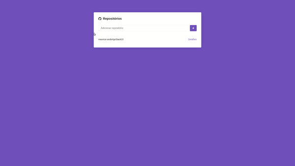

<h1 align="center">
  FACE-FAKE
</h1>

  <a href="#lista-de-correspondências">Lista de correspondências</a>&nbsp;&nbsp;&nbsp;|&nbsp;&nbsp;&nbsp;
  <a href="#sobre-o-projeto">Sobre o projeto</a>&nbsp;&nbsp;&nbsp;|&nbsp;&nbsp;&nbsp;
  <a href="#execução">Execução</a>

---
 

## Lista de correspondências
* Modulo 5: Primeiro projeto com ReactJS
* [Desafio 5: Primeiro projeto com ReactJS](./_instruction/Desafio05.md)

## Sobre o projeto
Este é um projeto ReactJs que apresenta uma interface para incluir projetos do github a uma listagem, os projetos incluídos à está listagem podem ser acessados de modo que sua descrição e issues sejam apresentadas, a listagem de issues apresentada é por padrão filtrada pelas issues ainda pendentes, mas é possível alterar esse filtro para consultar as issues encerradas.

  

## Execução
Para executar este projeto basta acessar o diretório do mesmo por meio do terminal e executar o comando `yarn start`
