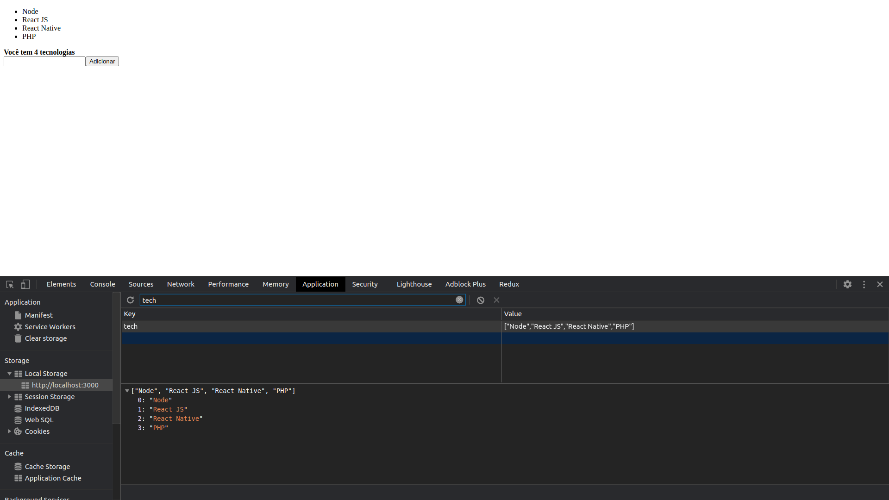

<h1 align="center">
  REACT-HOOKS
</h1>

  <a href="#lista-de-correspondências">Lista de correspondências</a>&nbsp;&nbsp;&nbsp;|&nbsp;&nbsp;&nbsp;
  <a href="#sobre-o-projeto">Sobre o projeto</a>&nbsp;&nbsp;&nbsp;|&nbsp;&nbsp;&nbsp;
  <a href="#execução">Execução</a>

---
 

## Lista de correspondências
* Modulo 8: Utilizando React Hooks

## Sobre o projeto
Este é um projeto ReactJs criado para demonstrar o funcionamento de hooks, embora tenha sido criado como um projeto ReactJs, o funcionamento das hooks é exatamente idêntico em projetos React Native.

  

## Execução
Para executar este projeto acesse o diretório do mesmo por meio do terminal e execute o comando `yarn start`
